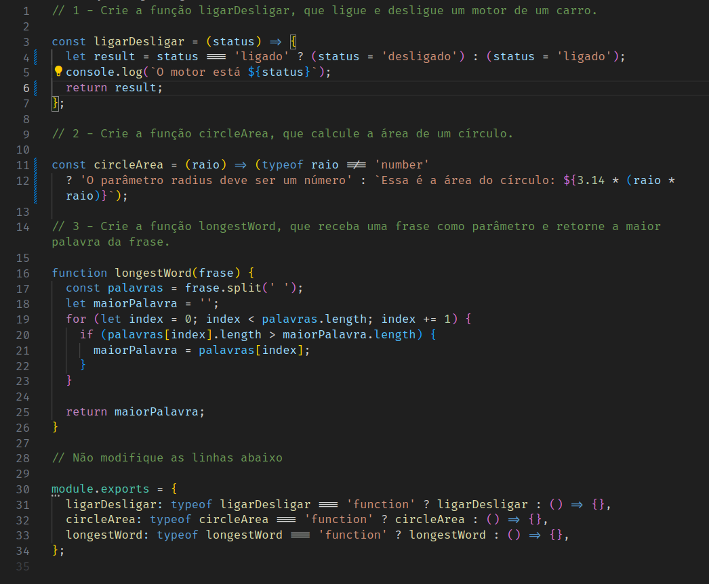

# README: Functions in practice



<br/>

In this project, I've written three functions using skills learned last week. Additionally, I have practiced logic and computational thinking."

## Project Description

This javascript project aims to test my hability in solve problems with code lines. Below are the key aspects of the project:

### Project Structure

The project consists of a single js file (`functions.js`) and an some tests using Jest (`/tests`).

### Technologies

- LINUX
- VSCODE
- JAVASCRIPT

### What I Learned

- How to use ternary operator 
- How to use template literals
- How to write arrow keys

## How to Run the Project

1. Clone the repository:

   ```bash
   git clone https://github.com/feduarte-dev/functions-in-practice
   ```

2. Navigate to the project directory:

   ```bash
   cd your-repository
   ```

3. Install dependencies:

   ```bash
   npm install
   ```

4. Open functions.js and call a function.

## Contributions

[Felipe](https://www.linkedin.com/in/feduarte-dev/) - /src/functions.js


[Trybe](https://www.betrybe.com/) - Everything else
